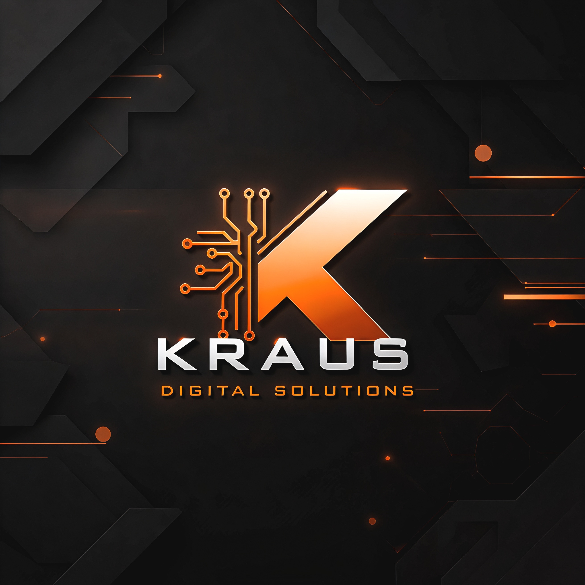

# KDS AI

Ein KI-gestützter Assistent für KDS.



## Aktuelle Version

**v5.3**

## Funktionen

- KDS-Infos können automatisch die direkte WhatsApp-Kontaktmöglichkeit enthalten\n- Sicherer Admin-Modus über the internen Admin-Zugang mit serverseitigem Admin-Token\n- Admin kann dauerhafte kundenrelevante Informationen per Chat eingeben\n- KI extrahiert Fakten aus Admin-Nachrichten und speichert sie in der Supabase-Wissensbasis\n- Gespeicherte Fakten werden bei späteren Kundenfragen wieder als Wissensbasis verwendet\n- Geheimnisartige Inhalte wie API-Keys, Tokens und Passwörter werden nicht als Wissensfakten gespeichert

- Moderne GitHub-Pages-Oberfläche
- Chat mit dem KDS AI-Assistenten
- KDS-Wissensdatenbank mit Leistungen und Preisen
- Unterscheidung zwischen normalen Preisen und Testkundenpreisen
- Automatische Antworten über die Supabase Edge Function
- OpenRouter als KI-Anbieter
- Keine API-Schlüssel im Frontend
- Responsive Darstellung für Smartphone und Desktop
- Überarbeitetes, reduziertes KDS-Interface
- Manueller Aktualisieren-Button zum Umgehen alter Browser-Caches
- KDS-Logo als Website-Logo, Browser-Icon und Social-Share-Bild
- `IMG_3297.jpeg` als zentrale Logo-Datei für Website, Browser und Teilen

## Projektaufbau

```text
GitHub Pages
    ↓
KDS AI Frontend
    ↓
Supabase Edge Function
    ↓
KDS-Wissensdatenbank + KI
    ↓
KDS-Kontaktfunktion → iCloud SMTP → adam_kraus@icloud.com
```

## Dateien

- `index.html` – Oberfläche der Web-App
- `style.css` – Design und responsive Darstellung
- `app.js` – Chat-Logik, Verbindung zum Backend, Kontakt-Erkennung und manuelles Aktualisieren
- `IMG_3297.jpeg` – KDS-Logo für Website, Browser-Icon und Social Sharing
- `supabase/functions/ai-chat/` – KI-Backend
- `README.md` – Projektdokumentation

## Kontaktregeln der KDS-KI

Die KDS-KI darf die geschäftliche E-Mail `kraus-digital@proton.me` als Kontaktadresse nennen, wenn ein Kunde ausdrücklich danach fragt.

Bei einer allgemeinen Frage nach Kontaktmöglichkeiten soll die KI nicht automatisch die E-Mail-Adresse nennen. Sie kann stattdessen anbieten, die geschäftliche E-Mail-Adresse zu geben.

Die KDS-WhatsApp-Nummer `+49 175 4081426` darf die KI als Kontaktmöglichkeit auch bei einer allgemeinen Kontaktfrage nennen.

Die administrative/private E-Mail `adam_kraus@icloud.com` darf genannt werden, wenn ausdrücklich nach der Admin-E-Mail oder privaten E-Mail gefragt wird. Sie darf nicht automatisch als allgemeine Kundenkontaktadresse verwendet werden.

## Versionierung

Die Versionsnummer wird bei Änderungen am Frontend aktualisiert.

Beispiel:

`1.1 → 1.2 → 1.3 → 1.4 → 1.5 → 1.6 → ... → 1.9 → 2.0`

Größere Funktionsänderungen können einen Sprung auf eine neue Hauptversion auslösen.

## Manueller Update

Wenn der Browser eine ältere Version der Website aus dem Cache geladen hat, kann über **„Aktualisieren“** oben rechts ein neuer Seitenaufruf mit Cache-Busting ausgelöst werden. Dadurch wird die aktuelle GitHub-Pages-Version neu geladen.

## Sicherheit

API-Schlüssel und andere geheime Zugangsdaten gehören ausschließlich ins Backend bzw. in die Supabase Secrets. Sie dürfen nicht in GitHub oder den öffentlichen Frontend-Code eingetragen werden.

## Status

KDS AI befindet sich aktuell im Aufbau und wird schrittweise erweitert.


## Automatische Kontaktanfragen

KDS AI kann bei einer konkreten Kundenanfrage automatisch eine ausführliche Benachrichtigung an `adam_kraus@icloud.com` senden. Das gilt nur für erkannte echte Kontakt- oder Projektanfragen, nicht für normale Wissensfragen oder reine Preisfragen.

Die Benachrichtigung enthält – soweit aus dem Chat verfügbar – den Zeitpunkt, Name und E-Mail des Kunden, die aufgerufene Seite, das verwendete KI-Modell, den auslösenden Satz und den bisherigen Gesprächskontext.

Der Versand erfolgt serverseitig über das vorhandene iCloud-Mailkonto. Die SMTP-Zugangsdaten werden ausschließlich als Supabase Edge-Function-Secrets gespeichert und niemals in GitHub oder im Browser veröffentlicht.

Für iCloud Mail wird der SMTP-Server `smtp.mail.me.com` auf Port `587` mit TLS/STARTTLS und einem App-spezifischen Passwort verwendet.

## Kostenmodell

Für den E-Mail-Versand wird kein Resend-, SendGrid-, Mailgun- oder anderer kostenpflichtiger E-Mail-Dienst verwendet. Es wird das vorhandene iCloud-Mailkonto genutzt.

Damit gibt es für diesen Versandweg keine zusätzliche E-Mail-Dienstgebühr. Die Nutzung von Supabase selbst unterliegt weiterhin den jeweiligen Grenzen des verwendeten Supabase-Tarifs.

## Einrichtung der Kontakt-Mail

In Supabase müssen für die Edge Function `kds-contact-email` diese Secrets hinterlegt werden:

`KDS_SMTP_USER` = vollständige iCloud-Mailadresse

`KDS_SMTP_PASSWORD` = App-spezifisches Apple-Passwort

Das normale Apple-Account-Passwort darf dafür nicht in GitHub, JavaScript oder der Website hinterlegt werden.

## Version 5.3

- Backup von v5.2 unter `versions/v5.2/`
- Automatische Erkennung konkreter Kunden-/Projektanfragen
- Ausführliche Kontaktbenachrichtigungen an die KDS-Admin-Adresse
- iCloud SMTP statt kostenpflichtigem Mail-API-Anbieter
- Keine SMTP-Zugangsdaten im Frontend
- Kontaktversand funktioniert über Hauptmodell, Cloudflare-Ausweichpfad und Cloudflare-Modellauswahl
